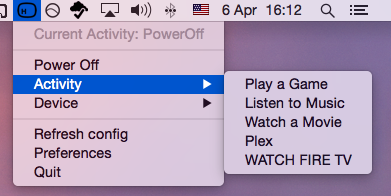

# Harmenubar

Small proof-of-concept menubar program for Mac OS X to control
Logitech Harmony hubs. For now the only thing implemented is switching
between activities.

This is just a quick hack, don't expect things to work perfectly out
of the box.

## Current issues

- Logitech password is stored in clear-text under
  `~/Library/Application Support/Harmenubar`
- Whole program locks up when connection to Logitech server is lost
  (need to wrap sleekxmpp in a better way to be able to do timeouts)
- No automatic detection of Harmony IP, needs to be specified by user

## Installation

### Prerequisites

[pyharmony] is used for accessing Logitech servers. It's currently a submodule
of this repository.

    git submodule init
    git submodule update

Note that the petele fork is used as it has more functionality that the owner
has not merged.

[pyharmony]: https://github.com/petele/pyharmony.git

[Rumps] is used for to create the graphical menubar stuffs from
Python. py2app is used to create a standalone OS X application from
the python scrips.

    pip install rumps py2app

[Rumps]: https://github.com/jaredks/rumps

### Create application

You can either run the python script directly from this directory:

    PYTHONPATH=./pyharmony python ui.py

Or create a standalone OS X application with py2app:

    PYTHONPATH=./pyharmony python setup.py py2app --package sleekxmpp

After this an application will be available under `dist/`

## Using

The first time the application is started a popup will be displayed
with a template config file. This file should be filled out with
Logitech credentials and IP number to your Harmony.
